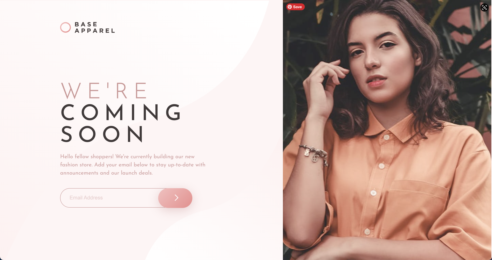

# Frontend Mentor - Base Apparel coming soon page solution

This is a solution to the [Base Apparel coming soon page challenge on Frontend Mentor](https://www.frontendmentor.io/challenges/base-apparel-coming-soon-page-5d46b47f8db8a7063f9331a0). Frontend Mentor challenges help you improve your coding skills by building realistic projects.

## Table of contents

- [Overview](#overview)
  - [The challenge](#the-challenge)
  - [Screenshot](#screenshot)
  - [Links](#links)
- [My process](#my-process)
  - [Built with](#built-with)
  - [What I learned](#what-i-learned)
- [Author](#ilonaGold)

**Note: Delete this note and update the table of contents based on what sections you keep.**

## Overview

### The challenge

Users should be able to:

- View the optimal layout for the site depending on their device's screen size
- See hover states for all interactive elements on the page
- Receive an error message when the `form` is submitted if:
  - The `input` field is empty
  - The email address is not formatted correctly

### Screenshot

### Links

- Solution URL: [Replit](https://replit.com/@ilonaGold/Base-Apparel-Coming-Soon-Page?v=1)
- Live Site URL: [Live Site](https://base-apparel-coming-soon-page--ilonagold.repl.co/)

## My process

### Built with

- Semantic HTML5 markup
- Flexbox
- Mobile-first workflow

### What I learned

I took this opportunity to practice mobile first, fully responsive development and impelementing a site design using only html and css.

## Author

- Website - [Github Profile](https://github.com/ilonaGold)
- Frontend Mentor - [@ilonaGold](https://www.frontendmentor.io/profile/ilonagold)
- Twitter - [@ilonaGold](https://twitter.com/Goldilla_Codes)
